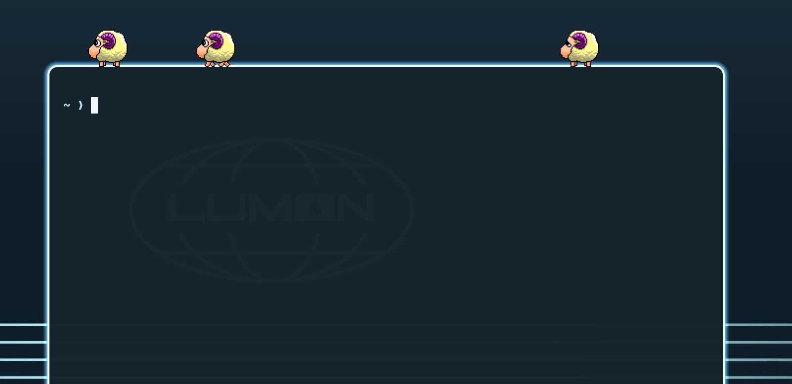

# eSheep for Omarchy

The '90s desktop pet, as an [Omarchy](https://github.com/basecamp/omarchy) shell
plugin. A sheep walks along the bottom of your screen. It climbs onto the top
edge of your Hyprland windows and walks along them. It falls, turns, lies down,
and plays other animations. You can pick up a sheep and drop it anywhere, and
on another monitor.



This plugin is a port of
[desktopPet](https://github.com/Adrianotiger/desktopPet). It uses the same
sprites and the same animation files, and gives the same behavior. It runs
inside `omarchy-shell` as a Quickshell plugin, not as a process of its own.

```shell
omarchy plugin add https://github.com/Jellyfrog/omarchy-esheep.git --enable
```

## Using it

1. Click the bar button to open the panel.
2. Right-click the bar button to send the pets away. Right-click it again to
   bring them back.
3. Middle-click the bar button to add one more pet.
4. Drag a pet with the left button.
5. Right-click a pet to send that one pet away.

The panel sets how many pets there are, which pet, the size, the speed, whether
pets climb on windows, and whether each pet keeps to one workspace. A toggle
for roaming between screens appears when you have more than one screen.

How many pets there are is also the on/off switch. A count of none is off, and
there is no second setting that can disagree with it.

A dragged pet plays its carried animation while you hold it. It falls from the
point where you let go: onto the floor, onto a window, or onto the monitor that
you dropped it over. A pet that you send away plays its farewell animation
first.

The rest of the desktop works as usual. The overlay is click-through
everywhere, except the sprite-sized rectangles that the pets occupy.

## Settings

Settings live inline on the plugin's entry in `~/.config/omarchy/shell.json`,
and `omarchy bar set jellyfrog.esheep <key> <value>` writes one:

| Key | Default | What it does |
|-----|---------|--------------|
| `pet` | `esheep` | Which pet, by folder name under `assets/` |
| `count` | `1` | How many pets (0-12). Zero is off |
| `scale` | `1` | Sprite magnification (0.5-6). Try `2` on a 4K screen |
| `speed` | `1` | Animation speed multiplier (0.25-4) |
| `walkOnWindows` | `true` | Land on window top edges and walk along them |
| `hideOnFullscreen` | `true` | Hide the pets while a window is fullscreen |
| `allowChildren` | `true` | Let an animation bring a second pet |
| `avoidBar` | `true` | Treat the Omarchy bar as the edge of the world |
| `roamMonitors` | `true` | Walk onto the next screen where they touch. Needs `lockToWorkspace` to be `false` |
| `lockToWorkspace` | `true` | Keep each pet on the workspace it appeared on |

## Pets

| `pet` | Who |
|-------|-----|
| `esheep` | The original eSheep. 54 animations |
| `sheep-blue` | gSheep Blue, by Oliver B. 268 animations, the most of any pet here |
| `neko` | The Neko cat |
| `pingus` | A penguin |
| `fox` | A fox, by Michelle Tran |

See [ATTRIBUTION.md](ATTRIBUTION.md) for who drew what.

## Adding your own pet

Any pet from the [upstream
database](https://github.com/Adrianotiger/desktopPet/tree/master/Pets) works.
One `animations.xml` file holds the sprite sheet, the icon, and the animation
graph, all encoded as base64. The converter turns that file into the files that
this plugin loads:

```bash
git clone --depth 1 https://github.com/Adrianotiger/desktopPet.git
tools/build-pets.py desktopPet/Pets --only mimiko,zombie
```

This command writes `assets/<pet>/{pet.json,sprites.png,icon.png}`. It also
refreshes `assets/pets.json`, which the pet picker reads. The converter needs
Pillow (`pip install pillow`). Nothing at runtime needs it.

Then run `omarchy-shell shell rescanPlugins`. Pick the new pet from the panel.

Pets that you drew yourself work the same way. The [upstream
editor](https://esheep.petrucci.ch) produces the same XML.

## Testing

```shell
test/all
```

`test/engine-test.sh` tests the engine. It then walks every shipped pet 4000
steps, with and without windows in the way. It makes sure that nothing throws,
that no coordinate becomes non-finite, and that no animation points off the
sprite sheet.

`test/layout-test.sh` covers the monitor arithmetic against real arrangements:
side by side, stacked, mismatched heights, a gap in the middle, and two screens
that share one edge. It also walks a pet back and forth across the seam.

`test/plugin-test.sh` validates the manifest, the entry points, the assets, and
the QML, as the shell does. All three scripts need only `node`.

On an Omarchy machine, `omarchy plugin validate .` runs the checks of the shell
itself.

## License

GPL-3.0-or-later, as upstream
[web-esheep](https://github.com/Adrianotiger/web-esheep). Sprites belong to
their authors. See [ATTRIBUTION.md](ATTRIBUTION.md).
